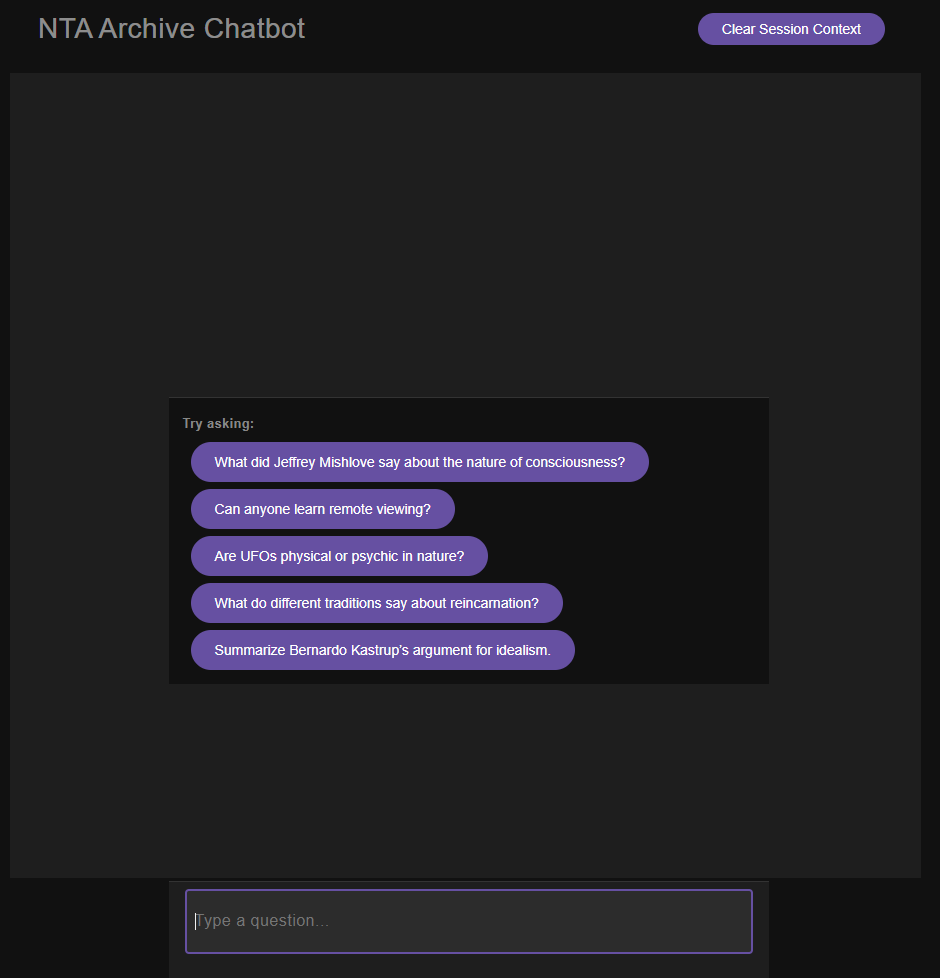
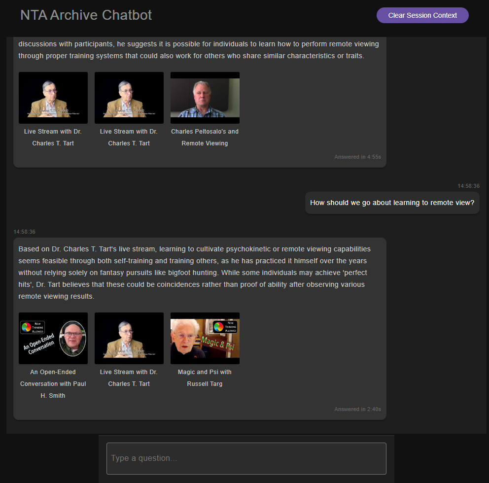

# NTA Video Caption RAG Chatbot

A Retrieval-Augmented Generation (RAG) chatbot that tries to answer user questions by searching and summarising video captions from the existing MySQL database's captions data. Powered by FAISS for fast vector similarity search and Ollama’s local LLM for natural language generation.

## Features
* Chunked video captions indexed with embeddings for efficient semantic search
* Vector similarity search with FAISS HNSW index for low-latency retrieval
* Uses sentence-transformers for generating text embeddings
* Local, privacy-preserving LLM integration via Ollama (phi3 model) for generating detailed, context-aware answers
* Summarizes and compresses conversation history for efficient multi-turn dialogue
* Session-based context management with lightweight frontend state and persistent session IDs
* FastAPI backend with Vue 3 frontend providing a smooth chat experience
* Includes metadata linking answers to original video timestamps and titles

<div style="display: flex; gap: 10px;">
  
  
</div>

## Tech Stack
* MySQL for storing video caption data
* Python 3 with FastAPI, FAISS, sentence-transformers, Ollama
* Vue 3 (Composition API) for frontend UI
* LocalStorage for session persistence on client
* REST API for chat queries

## Set Up

Install Ollama from https://ollama.com, then:

```bash
ollama pull phi3
```

```bash
cd python
pip install --upgrade pip
pip install -r requirements.txt
python create_index.py

cd client
bun run install
```

## Running

```bash
# Start the server at http://127.0.0.1:8000
cd python
bash ./serve.sh 
# Run a quick test
python rag_lib.py 

# Dev client at http://localhost:5173/
cd client
bun dev         

# test
cd client
bun run test

# Build a distribution bundle in dist/
bun run build
```

http://127.0.0.1:8000/docs


## Test Data

### PHILOSOPHY & CONSCIOUSNESS

What did Jeffrey Mishlove say about the nature of consciousness?

How do different guests define the soul?

Is there life after death according to the interviews?

What is the relationship between consciousness and quantum physics?

How is psi described by the various experts?

### UFOS, PSI, AND THE PARANORMAL

What are UFOs, according to Nick Cook?

Are UFOs physical or psychic in nature?

What links have been suggested between UFOs and the afterlife?

How do guests describe experiences with non-human intelligence?

What role do altered states play in contact experiences?

### MIND & PSI ABILITIES

Can anyone learn remote viewing?

How did Ingo Swann describe his experiences?

Are there scientific studies supporting telepathy or precognition?

How is intuition different from psi?

### SPIRITUALITY, SCIENCE, AND MYSTICISM

What do different traditions say about reincarnation?

How do modern scientists interpret mystical experiences?

Are science and spirituality fundamentally in conflict?

What has Dean Radin said about consciousness and the field?

###  GUEST-SPECIFIC

What are the key ideas shared by Rupert Sheldrake on morphic resonance?

Summarize Bernardo Kastrup’s argument for idealism.

What were the most surprising claims made by Stephan Schwartz?

What did Nanci Trivellato say about the out-of-body experience?
